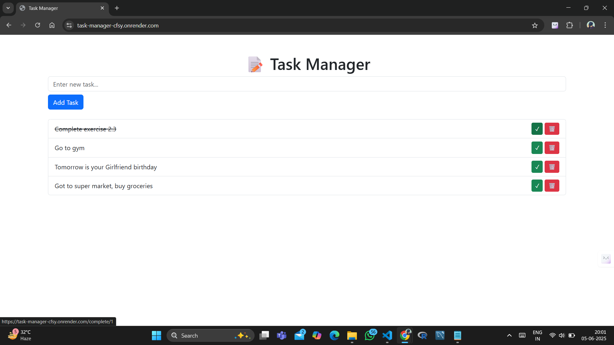

# 📝 Task Manager

A simple and attractive web-based To-Do List application built with Flask and SQLite. Easily add, complete, and delete your daily tasks with a clean Bootstrap interface.

[🌐 Live Demo](https://task-manager-cfsy.onrender.com)

---

## 🚀 Features

- Add new tasks quickly
- Mark tasks as completed (with strikethrough effect)
- Delete tasks instantly
- Responsive and modern UI (Bootstrap 5)
- Persistent storage with SQLite

---

## 🖥️ Screenshots



---

## 🛠️ Getting Started

### 1. Clone the repository
```powershell
git clone https://github.com/amritv0306/Task-manager
cd Task-manager
```

### 2. Install dependencies
```powershell
pip install -r requirements.txt
```

### 3. Run the application
```powershell
python app.py
```

Visit [http://127.0.0.1:5000](http://127.0.0.1:5000) in your browser.

---

## 📁 Project Structure

```
FlaskAppDay19/
│   app.py
│   requirements.txt
│   Procfile
│   runtime.txt
│   README.md
│
├───templates/
│       index.html
├───static/
│       (static files, e.g., CSS, JS)
└───instance/
        tasks.db
```

---

## ⚙️ Deployment

This app is ready to deploy on platforms like Render, Heroku, or any service supporting Flask. Example Procfile and runtime.txt are included.

---

## 📦 Requirements
- Python 3.8+
- Flask
- Flask-SQLAlchemy
- Bootstrap (via CDN)

---

## 🤝 Contributing
Pull requests are welcome! For major changes, please open an issue first to discuss what you would like to change.

---

## 📄 License
This project is open source and available under the [MIT License](LICENSE).
